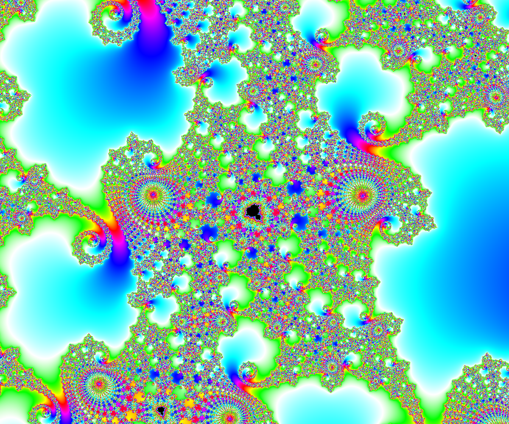

# Getting Started

How to get started using MandArt to generate custom art.

## Overview

This article shows how to get started creating and saving a custom MandArt image.

## Discussion

### Get MandArt

First, you'll want to get a copy of the MandArt App. 
You'll need a Mac that runs version 12.0 (Monterey) or higher.

### Start MandArt

Download and install the app and then open it on your machine.

### Welcome Screen

When the app starts up, you'll see the welcome screen. 
Click the **Get Started** button on the welcome screen to begin.

### Menu

The menu is a pretty standard Mac menu. 
Use File / New to make a new MandArt data document or File / Open... to find one on your machine. 

### Customize Inputs

Customize the inputs and watch MandArt update. 
For more information about each input field, see <doc:A02-SettingInputs>.

### Save MandArt

To save your MandArt inputs, 
use File / Save on the menu or click the **Save Data** button in the top left.

The data is stored in a document with a .mandart extension.
Inputs are stored in JSON format (a simple and common data format). 

### Save a Printed Image

To save your generated image as a .png file, click the **Save Image**button in the top left.

### Open Saved MandArt

Use File / Open to open a saved MandArt document. 

File / Open Recent is useful if you've got some previous MandArt documents from an earlier session.

### Share MandArt

You can save and share your MandArt document files with others so they can open them in MandArt as well.

### Exploration

Learn about all the ways to explore custom MandArt at <doc:A02-SettingInputs>.

Get help with common challenges at <doc:A03-Challenges>.

Read more about the math and the Mandlebrot set at <doc:A04-MoreAboutTheMath>.

Have fun! 

