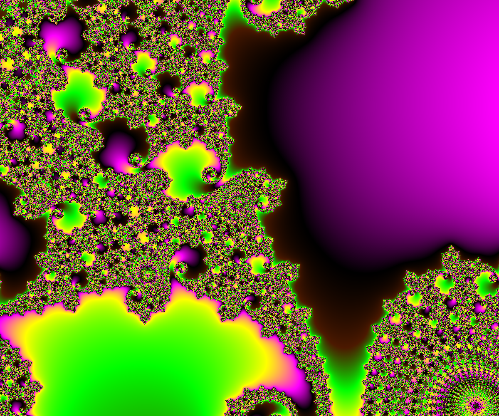

# Setting Inputs

Setting MandArt inputs to generate custom art.

## Overview

This article discusses each of the user-supplied inputs used to calculate MandArt.

## Discussion

### Mand App

This is an art app, not a math app.
It was specifically developed to generate pictures good enough to be printed, framed, and hung. 
You can completely ignore the math behind it, but it would help to have an idea of what’s going on. 
So, we’ll put all of the math at the end. 
This idea had to wait for modern computers to become available since the process requires a very great number of calculations. 
The app is written in the Swift computer language and uses SwiftUI for the interface.

### Mandelbrot and Mini-Mands

Fig 1 shows us the region of the x-y plane where the action will take place. 
The black area in Fig 1 is the major part of the Mandelbrot set, but around it is an infinite number of smaller, distorted versions of that part. 
Since we will keep referring to these objects, we’ll call the black area in Fig 1 the Mandelbrot. 
The other versions of it, which we’ll see soon, we’ll call Mini-Mands.

### Welcome Screen

Fig 2 shows the opening window in the app. Click on the Welcome to MandArt button.

### MandArt Main Window

Fig 3 shows the window after opening. 
The window isn't big enough to show the whole picture, so draw the lower-right corner until it shows the whole picture. 

### Finding MandArt - Centering and Zooming

We’ll use Fig 4 to explain centering and zooming. 

If you click anywhere in the right-hand image, 
the program will present a new image, centered on that location. 

If you press and hold the mouse button, you can drag the image. 
It will take a few seconds to recalculate and show it in the new location. 

You can zoom in or out by a factor of two by hitting the + or - buttons. 

### Customizing MandArt

A number of variables are listed in the buttons in the green area. 
You can change any of those values and hit return to use those new values. 

The screen goes blank when you start to enter any values, otherwise the program will update the image when each digit is entered. 
This is a problem that SwiftUI will solve, hopefully. 
This lets you fine-tune the image or input a set of values that you found in another reference.

### Coloring MandArt

The next set of variables relate to coloring the image. 

Default values were chosen so that the initial image would be colored. 

In order to reduce the number of colors that need to be entered, the program will cycle through the defined colors as many times as necessary. 

The region between each pair of numbers is called a block of colors. 

The program will also make a smooth gradient between each pair of colors. 

To emphasize the defined colors over the gradient colors, a slider is provided to define the fraction of a block that uses the defined color before starting the gradient. 

If a value near 1 is chosen, the blocks of colors will show up as solid bands. 

### Interesting Areas 

Fig. 5 shows typical areas where you might look for interesting images. 
They seem to be in areas that are near where two black areas come together. 

### Zooming 

Fig 6 shows an image that has been zoomed in by a factor of about 2,880,000/430 = 6,698. 

There are some obvious paths that seem to flow from the edge of the image into the interior. 

These paths can only end on the Mandelbot figure or on one of the Mini-Mands. 
However, the Mini-Mand may be so small that the we won’t be able to ever see it. 

If we keep zooming in, eventually the 15-digit significant places of a number in Swift will just start to show big blobs of color. 

### Iterations Before Converging - Minimum

The locations with the fewest iterations occur outside of the image, so the program ignores them. 

If we want to move the initial color in the image into the image, we can enter a value for Change in minimum iteration. 

If we enter a negative value, we’ll get a white area in the image, indicating where that minimum value is.

### Maximum Iterations And Blocks of Color

We typically use a large value for the maximum number of iterations and a small number for the number of blocks of color so we use an exponential relation between the two. 

The spacing between colors near the edges of the image, which is far from the Mini-Mand destination, is set by one variable and that near the Mini-Mand destination by another. 

Only trial and error and artistic preference will determine the best values. 

Likewise for the number of defined colors and the number of blocks of color.

### Joining Colors with Gradiants

If we define only a few colors, the gradients joining a pair of colors may go through regions of color that don’t look good. 

To help see what a gradient looks like, hit Go. 

After that, just enter a different number to see that gradient. 
To correct the problem, you can change one or both colors or add an intermediate color.

### Specifying Colors

The colors can be defined by inputting the (RGB) values or clicking on a color to get the Color Picker. 

The Color Picker has an eyedrop tool. This tool can select any color visible, in the app or not. 

A selection of 512 colors that look good on the screen is available by hitting Show Screen Colors. 

The eyedropper can be used to select one. 

