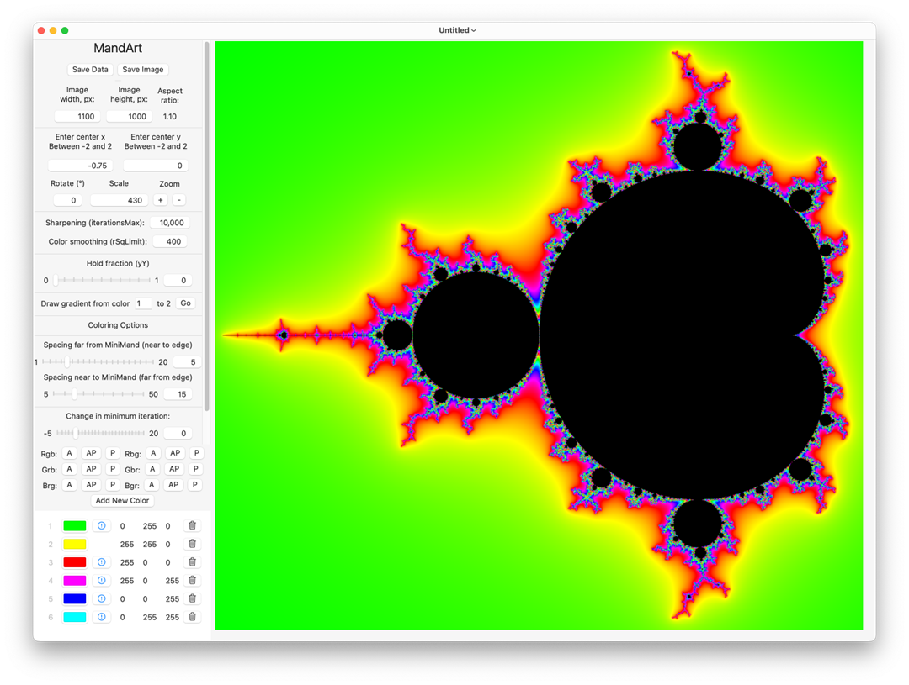

# Setting Inputs

Setting MandArt inputs to generate custom art.

## Overview

This article discusses each of the user-supplied inputs used to calculate MandArt.

## Discussion

### Mand App

This is an art app, not a math app.
It was specifically developed to generate pictures good enough to be printed, framed, and hung. 
You can completely ignore the math behind it, but it would help to have an idea of what’s going on. 
So, we’ll put all of the math at the end. 
This idea had to wait for modern computers to become available since the process requires a very great number of calculations. 
The app is written in the Swift computer language and uses SwiftUI for the interface.

### Mandelbrot and Mini-Mands

The above picture shows us the region of the x-y plane where the action will take place. 
The black area is the major part of the Mandelbrot set, 
but around it is an infinite number of smaller, distorted versions of that part,
which we can't see unless we zoom in. 
Since we will keep referring to these objects, 
we’ll call the black area in the picture the **Mandelbrot**. 
The other versions of it we’ll call **Mini-Mands**.

### Welcome Screen

This image shows the welcome screen in the app. Click on the Get Started button to begin.

### MandArt Main Window

This shows the main window after opening. 
The window isn't big enough to show the whole picture, 
so resize it by drawing the lower-right corner until it shows the whole picture. 

### Finding MandArt - Centering, Dragging, and Zooming

We’ll use this image to explain centering, dragging, and zooming. 

### Centering

If you click anywhere in the right-hand image, 
the program will present a new image, centered on that location. 

### Dragging

If you press and hold the mouse button, you can drag the image. 
It may take a few seconds to recalculate and show it in the new location. 

### Zooming

You can zoom in or out by a factor of two by hitting the + or - buttons. 
You can also change the magnification by changing the **scale** value. 

When you zoom in, it is like looking through a microscope. 
You can also think of it as expanding the image. 
If you zoom in as far as the 15 significant places that the Swift variable will allow, 
it is like moving a sheet of paper the size of your screen 
around in an area the size of the solar system. 

You should have no trouble finding a picture that no one has ever seen. 

In fact, if you don’t record that location, you’ll probably never be able to find
your way back.

### Customizing MandArt

A number of variables are listed in the buttons in the green area. 
You can change any of those values and hit return to update your art based on the new values. 

The screen may go blank when you start to enter certain values, 
because otherwise the program would update the image after each digit is entered. 
This is a problem that SwiftUI will solve, hopefully. 

These values allow you to fine-tune the image or input a set of values that you found in another
reference.

### Coloring MandArt

The next set of variables relate to coloring the image. 
Default values were chosen so that the initial image would be colored. 
To reduce the number of colors that need to be entered, 
the program will cycle through the defined colors as many times as necessary. 

The region between each pair of numbers is called a **block of colors**. 
The program will make a smooth gradient between each pair of colors. 

To emphasize the relatively few colors that we define over the colors the program calculates for the 
intermediate colors along the gradient, 
a slider is provided to define the fraction of a block that uses the defined color before starting the gradient. 
If a value near 1 is chosen, the blocks of colors will show up as solid bands. 

### Finding Interesting Areas 

This shows typical areas where you might look for interesting images. 
They seem to be in areas that are near where two black areas come together. 

### Interesting Example 

Here we show an image that has been moved to a new center, rotated, and zoomed in by a factor of about 2,880,000/430 = 6,698. 

There are some obvious paths that seem to flow from the edge of the image into the interior. 

These paths can only end on the Mandelbot figure or on one of the Mini-Mands. 
However, the Mini-Mand may be so small that the we won’t be able to ever see it. 

If we keep zooming in, eventually the 15-digit significant places of a number in Swift will just start to show big blobs of color. 

### Iterations Before Converging - Minimum

The locations with the fewest iterations occur outside of the image, so the program ignores them. 

If we want to move the initial color in the image into our MandArt, 
we can enter a value for **Change in minimum iteration**. 
If we enter a negative value, we’ll get a white area in the image, indicating where that minimum value is.

### Maximum Iterations And Blocks of Color

We typically use a large value for the maximum number of iterations and 
a small number for the number of blocks of color so we use an exponential relation between the two. 

The spacing between colors near the edges of the image, 
which is far from the Mini-Mand destination, is set by one variable and that near the Mini-Mand destination by another. 

Only trial and error and artistic preference will determine the best values. 
Likewise for the number of defined colors and the number of blocks of color.

### Joining Colors with Gradiants

If we define only a few colors,
the gradients joining a pair of colors may go through regions of color that don’t look good. 

To see what a gradient between two defined colors looks like, 
input a number for the left-hand number. 
The program will select the right-hand number. Click *Go*. 

After that, just enter a different number to see that gradient. 
If the gradient shows a region of color you don’t like, 
you can change one or both colors or you can add an intermediate color. 
We’ll come back to finding an intermediate color after we discuss coloring.

### Specifying Colors

The colors can be defined by inputting the (RGB) values or clicking on a color to get the Color Picker. 
The Color Picker has the usual Color Wheel, Color Sliders, Color Palettes, Image Palettes, and Pencils. 

It also has an **eyedropper** tool. 
This tool can select any color visible, in the app or not. 

### Viewing Color Options In the App

A selection of 512 colors that look good on the screen is available. 
These colors only use R, G, and B values of 0, 36, 73, 109, 146, 182, 219, and 255, 
but it is difficult to distinguish between adjacent colors, so they may be adequate. 

As mentioned, this app was designed to make a frameable picture. 
Unfortunately, printers can’t reproduce the range of colors available on the screen. 
So, a set of 292 colors that should print well is also available. 

- The button **A** displays all 512 colors. 

- The button **AP** displays the 292 colors in the format of the screen colors, 
so it is obvious that many of the best colors are missing. 

- The button **P** shows the 292 colors, but not in the format of the screen colors. 
It also shows the RGB values.

The **A** colors can be shown in six different orders (Rgb, Rbg, Grb, Gbr, Brg, and Bgr), but the upper-left is
always black and the lower-right is always white. The different orders just make it easier to see the color
groupings.

The pictures of the colors can be dismissed by clicking on the little **X** button at the top.

### Selected Colors List

The input colors can be reordered by dragging the color number or one of the three component colors up or
down.

An input color can be deleted by clicking on the Trash icon.

An input color can be redefined by clicking on its colored button and using the Color Picker or by changing the
color components.

The exclamation point in a circle icon warns you that the color may not print well. It can be ignored or the color
can be adjusted.

### Checking The Gradient Between Two Adjacent Colors

Getting back to finding an intermediate color in a gradient: We’ll try an example. 

Make the first color lime (0, 255, 0) and the second color magenta (255, 0, 255) and 
hit the **Go** button to draw a gradient between them.

The resulting picture shows a gray area in the middle. 
Grey doesn't usually make a good transition color.

### Fixing an Unpleasant Intermediate Color

To fix a poor transition color (e.g., gray), 
we'll first add the intermediate grey to our color list between the two adjacent colors we're workin on, 
and then select a better intermediate color.

1. Add a new color.
2. Click in its displayed colored area. 
3. Use the Color Picker Eyedropper to select a color near the middle of the gray area of the gradient. 
4. Verify the new color displays the unfortunate intermediate color.
5. Select the new color again and use the Color Picker to find a better color. The Color Sliders work well for this. Any set of three equal components will be a shade of gray, so avoid that. 
6. When you find a color you like, exit the Color Picker and hit Return to select it. 
7. Finally, move the new color up between the two adjacent colors (in this example, the first and second colors).

Now the first two gradients should look good. 

### Recommendation

Check the gradient between each two adjacent colors, 
including the last color (which will be adjacent to the first color in the list) to make sure the intermediate colors look good.
