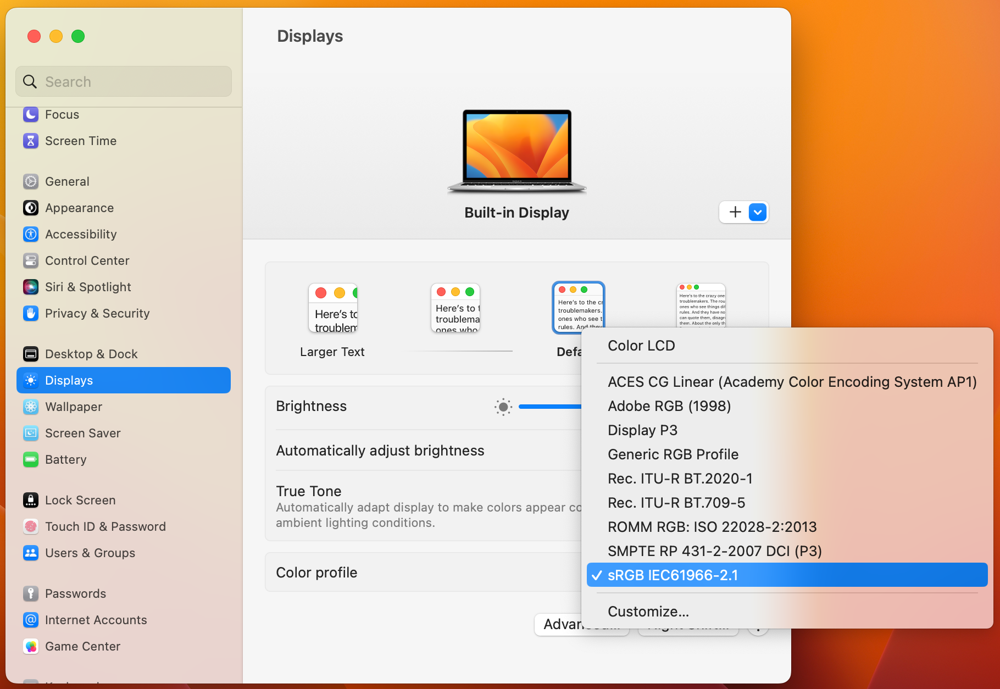

# Challenges

Working with colors presents some challenges.

## Overview

This article covers some of the challenges printing custom MandArt.

## Discussion

### Printing Colors

This app was designed to make a frameable picture. 
Unfortunately, printers can’t reproduce the range of colors available on the screen.

So, a set of 292 colors that should print well is available by hitting Show Print Colors. 
The format is the same as for the screen colors, so it is obvious that many of the best colors are missing.

### Color Profile

To get the printable colors to work, you may need to adjust your Color Profile.

Open System Settings / Displays / Color Profile - and on the drop-down, 
select the sRGB option as shown below. 

