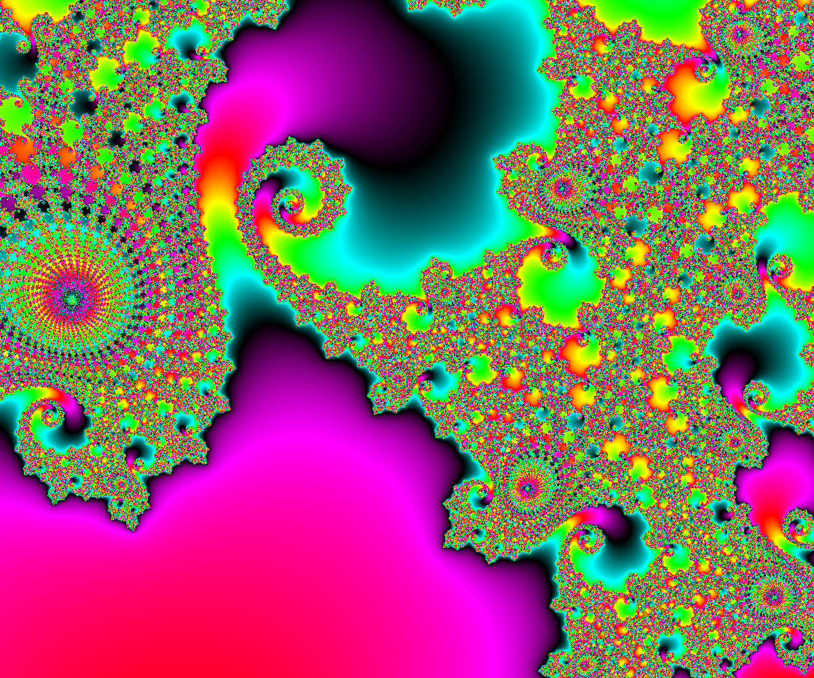

# More About The Math

MandArt is based on a popular fractal, the Mandlebrot set. 


## Overview

This article covers the ideas and math behind MandArt and the Mandlebrot set.




## Discussion

### The Mandelbrot Set

Now for a little math to help explain what’s going on.

How are these pictures generated? 

We start with an iterative formula: 

```math
z n+1 = zn^2 + c
```

where z and c are complex numbers. 

```math
z = x + iy
```

and 

```math
c = x0 + iy0
```

Since our computers don’t work with complex numbers, and they seem a little scary, 
we use a little math to get to real numbers. Then we can use the real x and y values of geometry. 
For each pixel location in the
image, the program starts with that location and computes a new location. The new location is tested to see if it
exceeds rSqLimit. If it does, the program records the number of iterations required to get there. If not, it checks
to see if the number of iterations has reached the maximum allowable number of iterations. If it does, it records
that number and goes on to the next pixel. If not, it computes a new location.

The distance from the origin to a point (x, y) is the square root of (x^2 + y^2). It has been shown that the distance
from the origin must grow to infinity if that distance ever exceeds 2. Since square roots are an unnecessary and
expensive calculation, we just use the distance squared, so the **distance** must grow to infinity if the **distance
squared** exceeds 4. We call the distance from the origin, r, so we compute r^2 and call it rSq.

We will use the number of iterations to help to define a color for that location.

What if we iterate many times and r^2 never exceeds the limit of 4? We call that limit rSqLimit. In general, we
can’t be sure that r^2 will ever exceed 4, so we pick a large number and say that, if we don’t exceed rSqLimit in
that number of iterations, we never will. We generally color that location black.

We use the variable, iterationsMax, for the maximum number of iterations to try. We start out with
iterationsMax = 10,000. Any time you find a black shape that doesn’t look like a Mini-Mand, it means you need
to increase iterationsMax. You define the RGB colors used in the image and their order. You also define the
numbers of blocks of color to be used, nBlocks. We start with six colors and 60 blocks. The colors we used are,
in order: lime, yellow, red, magenta, blue, and cyan. The program finds the minimum number of iterations used
at any location in the picture so that our coloring can start somewhere on the edge of our picture.

Why would we ever choose a value for rSqLimit greater than 4? This has to do with color smoothing. We find
the number of iterations required to exceed rSqLimit at each location in our image. We then assign a color to
that location based on that number of iterations. However, there will be many locations nearby that have the
same number of iterations. We would be left with bands of a uniform color, which may not look good.

To get color smoothing, we need another piece of information. What if, instead of picking 4 as the value for
rSqLimit, we picked a much higher value? We could then adjust the number of iterations by a fraction
depending on how high r^2 got to in exceeding rSqLimit. We call that value of r^2 , rSqMax. We can calculate just
how large rSqMax could possibly be for a given value of rSqLimit. rSqMax is simply (rSqLimit + 2)^2.

We want to define a value that acts like a fractional value for the number of iterations required to exceed
rSqLimit, so we defined something that acts like a differential iteration as:

```math
dIter = (r^2 - rSqLimit)/(rSqMax - rSqLimit)
```

and a fractional iteration as:

```math
fIter = iter - dIter.
```

The program puts each value of fIter into a two-dimensional array of values covering the width and height of
the image.

A plot of fIter against location would show a very non-linear curve. That would not be good for smoothing out
the colors, so an equation using logarithms of logarithms computes dIter from r^2 , rSqLimit, and, rSqMax.

This helped to makes dIter much more linear and looks better. Then we just linearly vary the R, G, and B color
components to get the desired color smoothing.


### The Mandelbrot set

The Mandelbrot set is a mathematical formula. 
It is a complex function that generates a set of complex numbers based on the iteration of a simple equation. 
The equation is used to generate the points in the complex plane that are part of the Mandelbrot set. 
The set is named after the French mathematician Benoît B. Mandelbrot, who studied and popularized it in the late 20th century.

All we really have to know is that i^2 = -1 and that an i in front of a number means it is measured along the y axis of the standard x-y plane. 

The initial value of z(n) is 0 + i0. The values of x0 and y0 remain fixed while we iterate. 

That’s just part of the definition of the Mandelbrot set.
