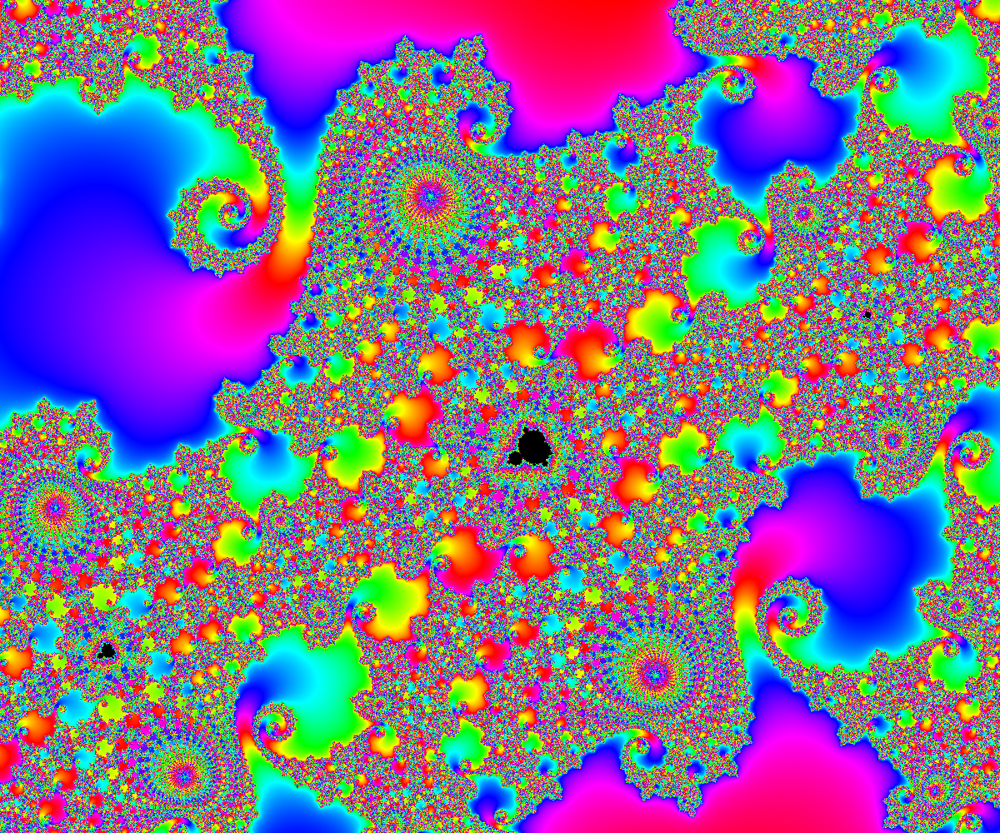

# ``MandArt``

Create custom art from the Mandelbrot set.

## Overview

MandArt is the ultimate app for creating custom art from the Mandelbrot set. 

Read more in the articles below.

## Topics

### Getting Started

- <doc:A01-GettingStarted>

### Setting Inputs

- <doc:A02-SettingInputs>

### Challenges

- <doc:A03-Challenges>

### More About the Math

- <doc:A04-MoreAboutTheMath>

### API Reference 

- <doc:A05-API>
